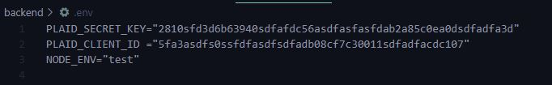
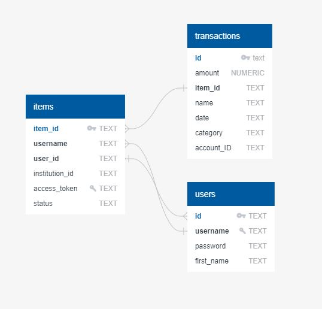

# Cash Counselor

Cash Counselor is your one-stop-shop for learning about your spending habits.

The site is deployed [here](https://cash-counselor.herokuapp.com/).

No worries. You will use a dummy bank account to try out the app, not your real one. No need to worry about exposing your sensitive banking data.

### Tech Stack

##

- Backend: Express, PostgreSQL
- Frontend: React

### Data

##

API Used:

- The [Plaid API](https://plaid.com/docs/) connects users to their real life banking institutions and allows user to retrieve their banking data. Once logged-in, account information such as transactions, routing numbers, and account numbers are made available.

### Features

##

- Account summary cards for all bank accounts associated with your bank login.
- Visualize your transaction history with a bar chart or pie chart that graphs your data by time period, amount, and/or category of transaction.
- List and (optionally) filter all transactions for a given account (ex: Checking, Savings, Credit Card etc) by time period, amount, and/or category of transaction.
- Security Feature: Auto-timeout one's banking session once user goes inactive for 10 mins so unauthorized users cannot gain access to your sensitive information.
- User can create an account, edit its password or username, and delete the account.

### User Flow

##

1. User must create an account or login into the 1st layer of the app.
2. User can now login into their banking institution with the credentials for their "actual" bank account.
3. Upon login, user sees account summaries for all of their bank accounts.
4. User can click on a specific account, and see all of their transactions for their given account.
5. User can click on "Trends" and initiate a graph that depicts one's transaction history.

### Testing

##

##### Front End

Testing on the front end can be done fairly simply.

###### Components Test:

1. In your terminal enter into the frontend folder and then install the package.json file.
2. Comment out line 88 of Account.js located at ./frontend/components/ and uncomment line 87.
3. Comment out line 11 of FilterTransactionsForm.js located at ./frontend/components/ and uncomment line 10.
4. Now in your terminal enter into ./frontend/src/\_\_tests\_\_/components and run command npm test Components.test.js

###### Action Creators Test:

1. Do step one from right above if you haven't done so already.
2. In your terminal enter into ./frontend/src/\_\_tests\_\_/components and run command npm test ActionCreators.test.js

##### Backend

Testing on the backend requires one to signup for their own API keys from [Plaid](https://plaid.com/).

Once that is done, follow along to run the test.

1. Inside the backend folder, install package.json
2. Create a .env file in the root of your backend file, then add your PLAID\_SECRET\_KEY, PLAID\_CLIENT_ID and NODE\_ENV to the file. Mine looks like this. (Those aren't my real API keys) 
3. There is a chance that your test won't pick up on the keys in the .env file. In the event that this occurs, place your keys in their respective variable assignments directly into the config.js file. This is a workaround, so please make sure you delete them from the config.js file when you are done testing. Don't upload any files with your keys to github or any place where they are exposed to the public.
3. Create a postgres database named cash\_counselor\_test and seed the database with the data.sql in the root of the backend folder.
4. Enter into the \_\_tests\_\_ folder and enter the following command in your terminal for each file there, ONE BY ONE. Please do not run all files at once.
5. jest NAME\_OF\_FILE.test.js (ex: jest ItemRoutes.test.js)

### Database Design

##

An overview of how the database is set up.  

